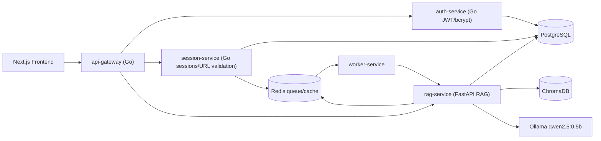

# Talk to Docs

A scalable microservices-based AI web app for asking questions strictly grounded in one documentation or article URL per chat session.

## Architecture



## Services

- `frontend`: Next.js + Tailwind UI with login, register, dashboard, chat history, URL intake, and document-scoped chat.
- `api-gateway`: Go reverse proxy with CORS, JWT verification, protected routes, and rate limiting.
- `auth-service`: Go user registration/login/profile with bcrypt password hashing and JWT generation.
- `session-service`: Go chat-session orchestration, URL validation, SSRF protection, document dedupe, and Redis ingestion jobs.
- `rag-service`: FastAPI scraping, cleaning, chunking, embeddings, Chroma storage, Redis memory, and strict context-only chat.
- `worker-service`: Redis queue consumer for background document ingestion.
- `ollama`: lightweight local LLM for answer synthesis.
- `postgres`, `redis`, `chroma`: persistence, cache/job memory, and vector storage.

## Quick Start

```bash
cp .env.example .env
docker compose up --build
```

Open:

- Frontend: `http://localhost:3000`
- API gateway: `http://localhost:8080`
- Chroma HTTP: `http://localhost:8001`

The default Docker stack runs a lightweight local Ollama model (`qwen2.5:0.5b`) for natural answers. The first startup downloads the model into the `ollama_data` Docker volume. To use a different Ollama model, set:

```bash
OLLAMA_MODEL=llama3.1
```

To use Ollama running on your host instead of the Compose service, set:

```bash
OLLAMA_BASE_URL=http://host.docker.internal:11434
```

If Ollama is unavailable, the app falls back to a strict extractive answer over retrieved chunks.

By default, the Docker RAG image uses the built-in hash embedder to avoid pulling multi-GB PyTorch/CUDA wheels. To opt into `sentence-transformers` embeddings, build the RAG image with:

```bash
docker compose build --build-arg INSTALL_ML_EMBEDDINGS=true rag-service
```

## Core Guarantees

- A chat session is linked to exactly one `source_url` and `doc_id`.
- URL validation rejects social/video/audio/image-only/private-network/low-text pages.
- Retrieval filters by `user_id`, `session_id`, and `doc_id`.
- Chat history is used only for conversational continuity, not as factual source material.
- Missing information returns: `I could not find this information in the provided documentation.`
- Answers include source references with source URL, heading, chunk index, and excerpt.

## API

See [docs/api-docs.md](docs/api-docs.md).

## Prompt

See [docs/prompt-design.md](docs/prompt-design.md).

## Local Development

Format Go services:

```bash
make fmt
```

Run individual services by setting the same variables shown in `.env.example`.
