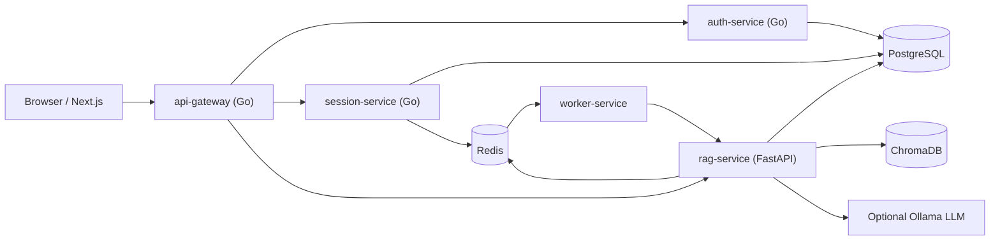

# Architecture

## Request Flow

1. User registers or logs in through the gateway and receives a JWT.
2. User creates a session by submitting one documentation/article URL.
3. The session service validates URL shape, status, content type, text density, article/documentation signals, and SSRF safety.
4. The session service creates a document and chat session, then pushes an ingestion job to Redis.
5. The worker calls the RAG service to scrape, clean, parse, chunk, embed, and store chunks in Chroma by `user_id`, `session_id`, and `doc_id`.
6. Chat requests retrieve only chunks linked to the same session/document and generate strict context-only answers.

## Scaling Notes

- Ingestion is asynchronous and queue-based.
- Redis stores chat memory and job state.
- URL hashes deduplicate repeated documents per user.
- Gateway rate limiting protects chat and ingestion endpoints.
- Scraping uses timeout, max-size, content-type, redirect, and private-IP controls.
- Chroma can be replaced with a managed vector database behind `VectorStore`.
